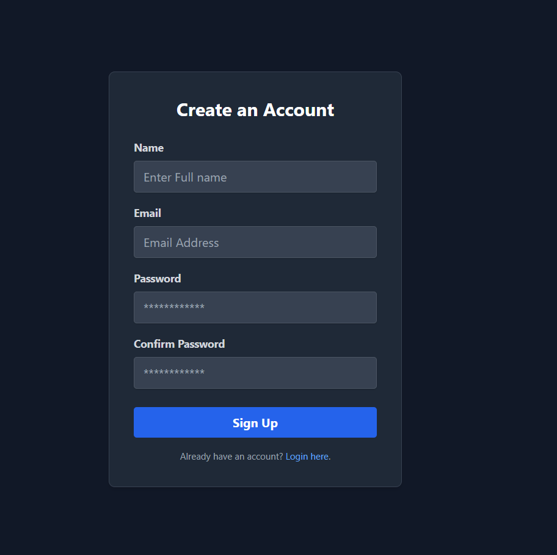

# Book Review Platform 
- Tahir Uddin Ahmed

This is a web application built with Laravel, Tailwind CSS, and MySQL that allows users to browse books and submit reviews. The platform includes a full authentication system and robust CRUD (Create, Read, Update, Delete) functionality for both books and reviews.

## Features
 - <b>User Authentication</b>: Secure login and registration for users.

 - <b>Book Management</b>: Browse a list of books with details like author and publication date.

 - <b>Review System</b>: Users can submit, edit, and delete their own reviews for any book.

 - <b>Full CRUD Operations</b>: Complete control for managing books and reviews.

 - <b>Performance</b>: Utilizes Laravel's caching system to efficiently store and retrieve book data, which significantly reduces database queries and improves loading times.

 - <b>MVC Architecture</b>: Structured using Laravel's Model-View-Controller pattern for a clean, maintainable codebase.

 - <b>Eloquent ORM</b>: Manages relationships between books, reviews, users, and authors for simple and intuitive data handling.

## Snapshots 
### Home Page 


### Register & Log in 



### Show a single Book


### Add Review 


## Authors book: List all the books by a author


## Add a Book


## Installation
### Prerequisites
* [x] PHP >= 8.0
* [x] Composer
* [x] MySQL
* [x] Node.js & npm

### Steps 
1. Clone the repository 
```bash
git clone https://github.com/tahiruddinahmed/Book-review.git
```

2. Install PHP Dependencies: 
```bash
php composer install 
```

3. Setup Environment: 
Go to the project directory `copy` the `.env.example`, create a new file called `.env` and past all the codes.

```bash 
cp .env.example .env
```
Open the `.env` file and configure your database connection and other settings

4. Run PHP Migration and Seed the Database. 
```bash
php artisan migrate --seed
```

5. Start the project 
```bash 
php artisan serve
```


## Contributing
Feel free to fork this repository, submit pull requests, or open issues. Any contributions are welcome!

